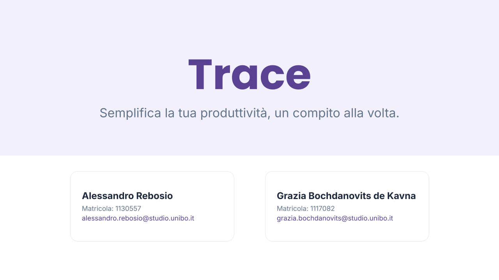
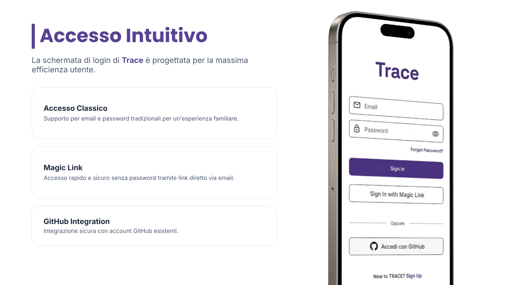
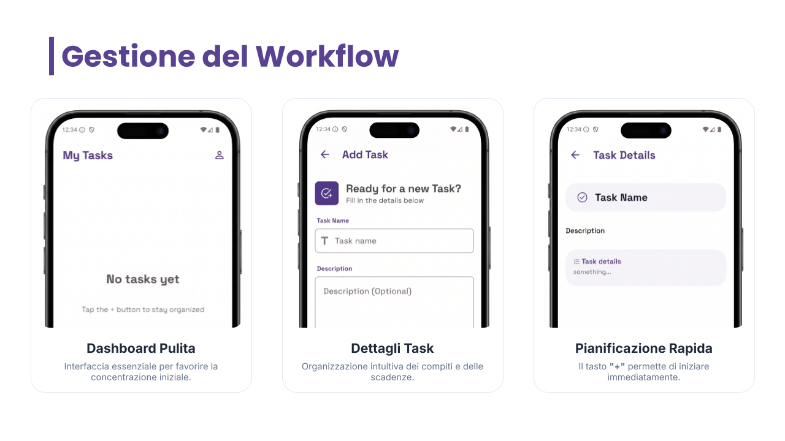
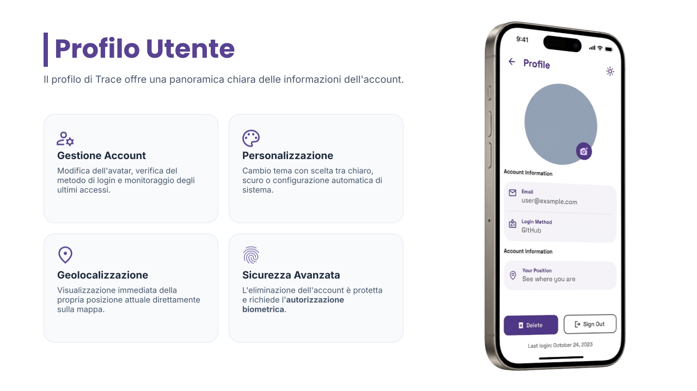
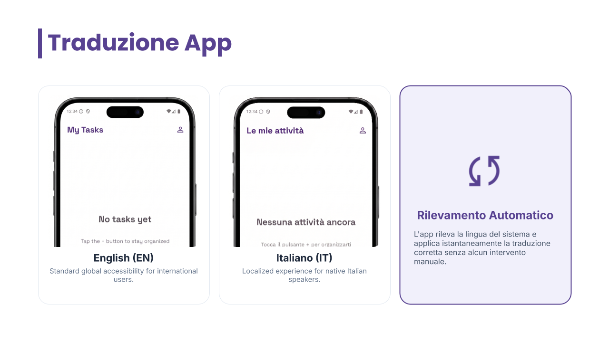

# MSP26-TRACE
A simple and organized Todo application built with Kotlin, Jetpack Compose, and Supabase.

## Setup Instructions
To get the application running locally, follow these steps:

### 1. Supabase Configuration

Create a `local.properties` file in the root directory (if it doesn't exist) and add your Supabase credentials:
```properties
supabase.url="YOUR_SUPABASE_PROJECT_URL"
supabase.key="YOUR_SUPABASE_ANON_KEY"
```

### 2. Database Schema

In your Supabase SQL Editor, create the `Todos` table with the following structure:

```sql
create table public."Todos" (
  id bigint generated by default as identity not null,
  created_at timestamp with time zone not null default now(),
  name text null default '""'::text,
  uid uuid not null,
  description text null,
  constraint todos_pkey primary key (id),
  constraint Todos_uid_fkey foreign KEY (uid) references auth.users (id) on delete CASCADE
) TABLESPACE pg_default;

create table public."Profiles" (
  id uuid not null,
  avatar_url text null,
  constraint profiles_pkey primary key (id),
  constraint Profiles_id_fkey foreign KEY (id) references auth.users (id) on delete CASCADE
) TABLESPACE pg_default;
```

### ⚠️ Important: Row Level Security (RLS) & Policies

Before using the app, you **must** configure access permissions in the Supabase Dashboard:

1. **Enable RLS**: Go to **Database > Tables** or **Authentication > Policies** and enable RLS for both `Todos` and `Profiles` tables.
2. **Todos Policies**:
    * **Target**: `Authenticated` users.
    * **Condition**: `auth.uid() = uid` for `SELECT`, `INSERT`, `UPDATE`, and `DELETE`.
3. **Profiles Policies**:
    * **Target**: `Authenticated` users.
    * **Condition**: `auth.uid() = id` for `SELECT` and `UPDATE`.
4. **Storage**:
    * Create a **public** bucket named `avatars`.
    * Add a policy to allow `Authenticated` users to `UPLOAD` and `UPDATE` files where the path matches their user ID.

### 3. GitHub Authentication

To enable GitHub Login:
1. Go to the [GitHub Developer Settings](https://github.com/settings/developers) and create a new **OAuth App**.
2. Set the **Homepage URL** to your Supabase project URL.
3. Set the **Authorization callback URL** to: `https://<YOUR_PROJECT_ID>.supabase.co/auth/v1/callback`.
4. In the Supabase Dashboard, go to **Authentication > Providers > GitHub**.
5. Enable the provider and enter your GitHub **Client ID** and **Client Secret**.
6. Ensure you have added the redirect URI `it.unibo.trace://login-callback` in the **Authentication > URL Configuration** section of Supabase.

## Presentation Slides

Below is a gallery of the project's presentation slides.

**Mockups:** [View the mockups here](https://www.figma.com/design/1NjQgD9Bf75vzC5Gzau5Ip/MOBILE26)

### Title Slide
<p align="center">
  
</p>

### More Slides
<details>
<summary>Click to expand for the full presentation</summary>
<br>

<p align="center">
  
  
  
  
</p>
</details>

## Team Members

#### Grazia Bochdanovits de Kavna
- **GitHub**: [this-Grace](https://github.com/this-Grace)
- **Email**: [grazia.bochdanovits@studio.unibo.it](mailto:grazia.bochdanovits@studio.unibo.it)

#### Alessandro Rebosio
- **GitHub**: [alessandrorebosio](https://github.com/alessandrorebosio)
- **Email**: [alessandro.rebosio@studio.unibo.it](mailto:alessandro.rebosio@studio.unibo.it)
